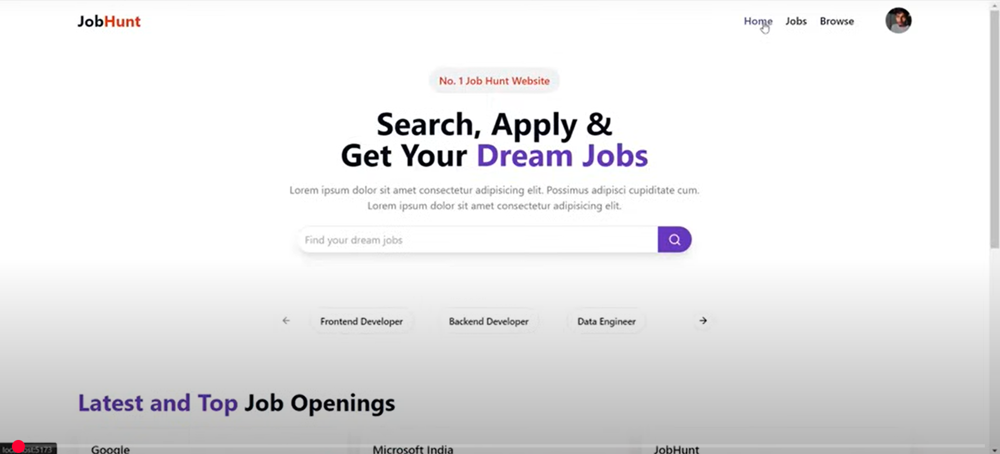
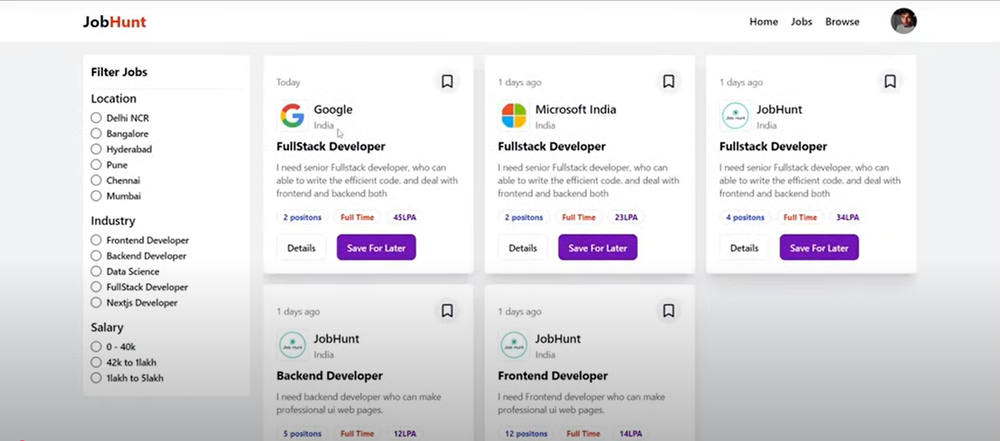
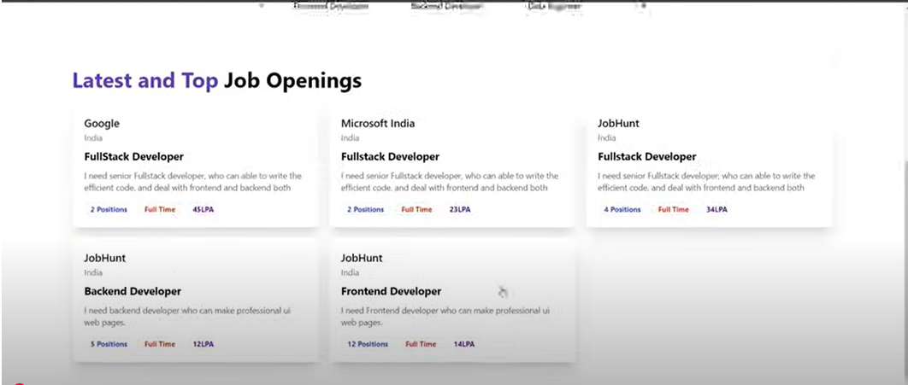
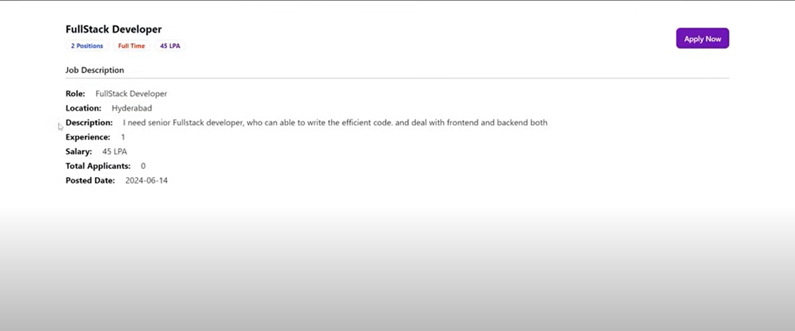
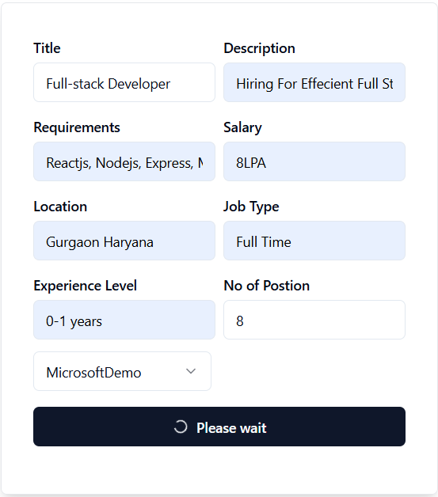
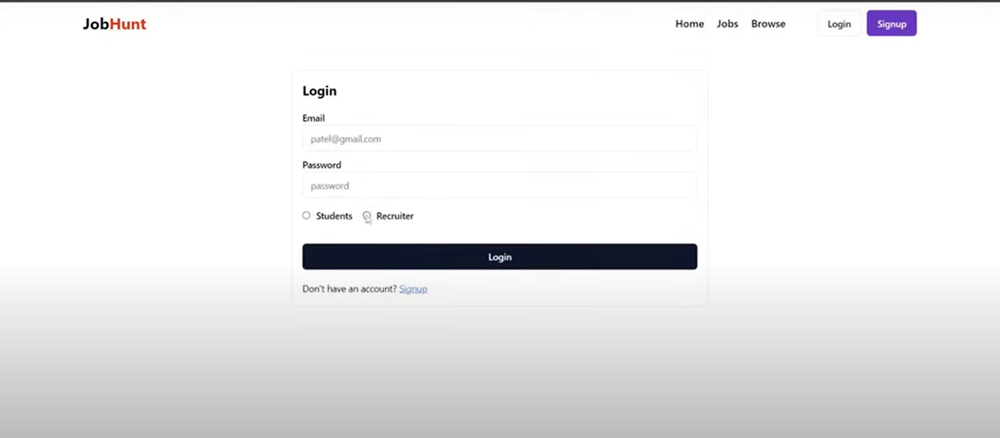
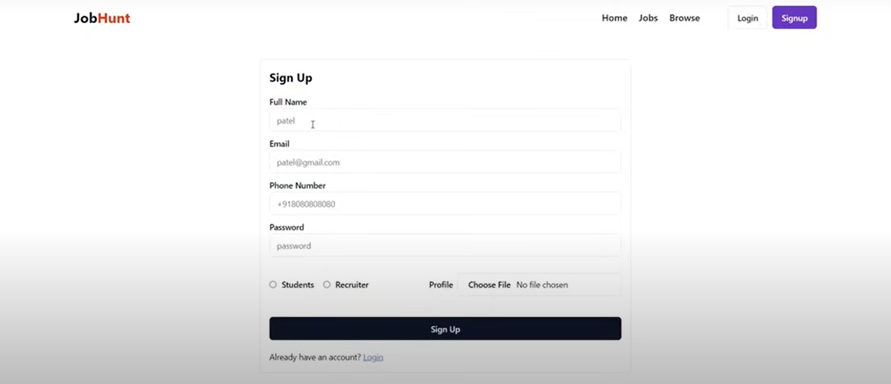
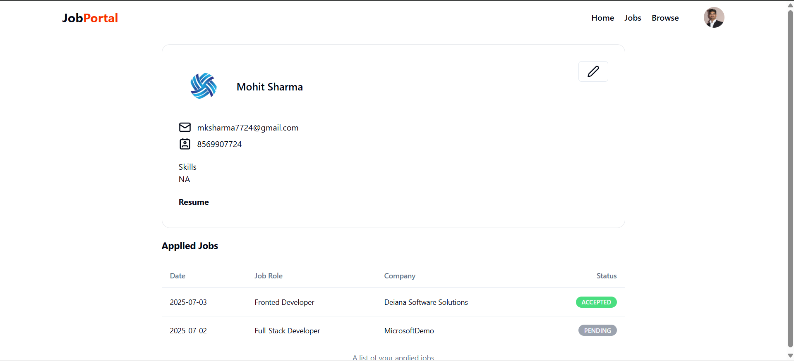
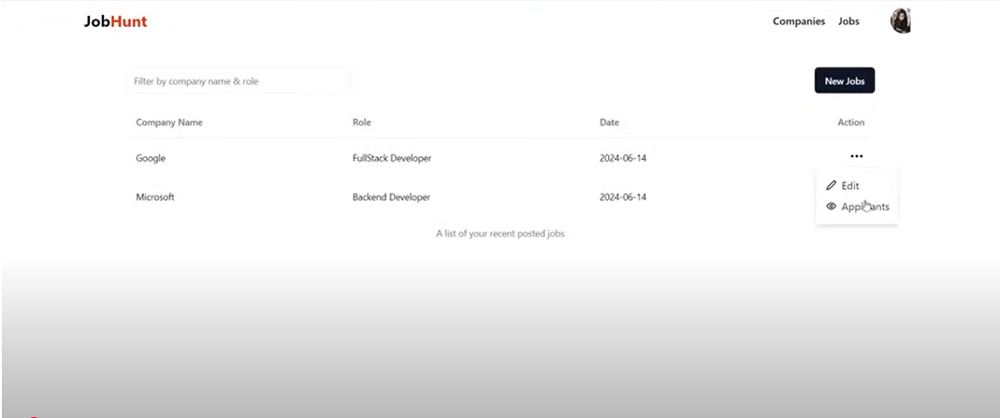

# 💼 Job Hunt – Your Gateway to Opportunities

 

### Highlights 🚀
- Streamlined job portal connecting applicants and recruiters
- Secure authentication with JWT and role-based access control
- Media uploads via Cloudinary; fully responsive UI with Tailwind and Framer Motion
- Deployed live on Render with CI/CD pipeline

---

## 🚀 Live Demo

Explore the live application here:
[https://job-hunt-gcpq.onrender.com](https://job-hunt-gcpq.onrender.com)

**Demo Credentials (optional)**  
- **Recruiter**  
  Email: `recruiter@example.com`  
  Password: `123`  

- **Applicant**  
  Email: `applicant@example.com`  
  Password: `applicant123`

---

## ✨ Major Features

### 🧑‍💼 Recruiter
- Post, edit, delete jobs
- View applicants & update application status
- Admin dashboard for job/company management
- Upload company logo via Cloudinary

### 👨‍🎓 Applicant
- Signup/login with secure auth (JWT)
- Apply for jobs & check statuses
- Upload/download resume via Cloudinary
- Personal profile dashboard (skills, bio, contact, applied jobs)
- Filter/search jobs by location, industry, salary
- View latest & featured jobs

### 🎯 General
- Role-based access control (Applicant vs Recruiter)
- Protected routes with JWT + Redux Persist
- UI animations via Framer Motion
- Custom React hooks for API handling
- Responsive design with ShadCN UI + Tailwind CSS

---

## 🖼️ Screenshots

### Home Page  

### Jobs Page  

### Latest Jobs  

### Job Details  

### Post Job  

### Login Page  

### Sign Up Page  

### Profile Page  

### Recruiter Dashboard  

🛠️ Tech Stack
Backend
Node.js + Express.js

MongoDB Atlas (jobhunt DB) via Mongoose

Multer + Cloudinary for file uploads

JWT authentication with role-based middleware

Frontend
React.js + Vite

Redux Toolkit + Redux Persist

ShadCN UI + Tailwind CSS

Framer Motion for animations

🌍 Environment Variables
Create a .env file in both frontend and backend with the following:

🔐 Backend .env
PORT=5000
MONGO_URI=your_mongodb_connection_string
JWT_SECRET=your_jwt_secret_key
CLOUDINARY_CLOUD_NAME=your_cloud_name
CLOUDINARY_API_KEY=your_api_key
CLOUDINARY_API_SECRET=your_api_secret
🌐 Frontend .env
VITE_BASE_URL=http://localhost:5000/api/v1

🗃️ Database
Database Name: jobhunt

Collections: users, jobs, applications, companies

Credentials are securely handled via JWT—no hardcoded secrets.

📁 Project Structure
📁 server/
   ┣ controllers/
   ┣ models/
   ┣ routes/
   ┣ middleware/
   ┗ config/
📁 client/
   ┣ components/
   ┣ pages/
   ┣ redux/
   ┣ services/
   ┗ hooks/
🧪 Testing
Backend APIs tested via Postman

Token verification middleware validated

Frontend manually tested across flows with validation and alert messaging

🤝 Contributing
Your contributions are welcome! To contribute:

git clone https://github.com/Restymohit/Job-Hunt
cd job-hunt
npm install
Submit issues or pull requests to help improve the project.

🙋‍♂️ Contact
Mohit Sharma

LinkedIn: mohit-sharma-75435b232

Email: mksharma7724@gmail.com

📄 License
This project is open-sourced under the MIT License. Feel free to use, modify, and distribute it!

